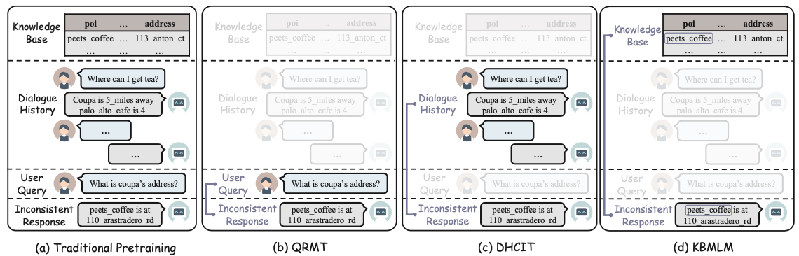

# *MPFToD: A Modularized Pre-training Framework for Consistency Identification in Task-oriented Dialogue*

 [](https://opensource.org/licenses/MIT) 

This repository contains the PyTorch implementation and the data of the paper: **MPFToD: A Modularized Pre-training Framework for Consistency Identification in Task-oriented Dialogue**. 

## Abstract

Consistency identification in task-oriented dialogue (CI-ToD) can prevent inconsistent dialogue response generation, which has recently emerged as an important and growing research area. This paper takes the first step to explore a pre-training paradigm for CI-ToD. Nevertheless, pre-training for CI-ToD is non-trivial because it requires a large amount of multi-turn KB-grounded dialogues, which are extremely hard to collect. To alleviate the data scarcity problem for pre-training, we introduce a modularized pre-training framework (MPFToD), which is capable of utilizing large amounts of KB-free dialogues. Specifically, such modularization allows us to decouple CI-ToD into three sub-modules and propose three pre-training tasks including (i) query response matching pre-training; (ii) dialogue history consistent identification pre-training; and (iii) KB mask language modeling to enhance different abilities of CI-ToD model. As different sub-tasks are solved separately, MPFToD can learn from large amounts of KB-free dialogues for different modules, which are much easier to obtain. Results on the CI-ToD benchmark show that MPFToD pushes the state-of-the-art performance from 56.3% to 61.0%. Furthermore, we show its transferability with promising performance on other downstream tasks (i.e., dialog act recognition, sentiment classification and table fact checking).

## Model



## Preparation

The  packages we used are listed follow:

```
-- scikit-learn==0.23.2
-- numpy=1.19.1
-- pytorch=1.1.0
-- wandb==0.12.9
-- tqdm=4.49.0
-- sklearn==0.0
-- transformers==3.2.0
```

We highly suggest you using [Anaconda](https://www.anaconda.com/) to manage your python environment. If so, you can run the following command directly on the terminal to create the environment:

```
conda env create -f py3.6pytorch1.1_.yaml
```

Then, you need to download the datasets in [link](https://drive.google.com/file/d/1GyVmgl3qkwv1kscLe2Hjf9k7kYymPhEu/view?usp=sharing), and unzipped it into root path `data`.

## How to run it

The script **pretrain.py** acts as a main function to the project, you can run the experiments by the following commands:

```
python -u pretrain.py --cfg MPFToD_BERT_all.cfg
```

The parameters we use are configured in the `configure`. If you need to adjust them, you can modify them in the relevant files or append parameters to the command.

If you have any question, please issue the project or email [Shijue Huang](mailto:joehsj310@gmail.com) or [Libo Qin](mailto:lbqin@csu.edu.cn) and we will reply you soon.

